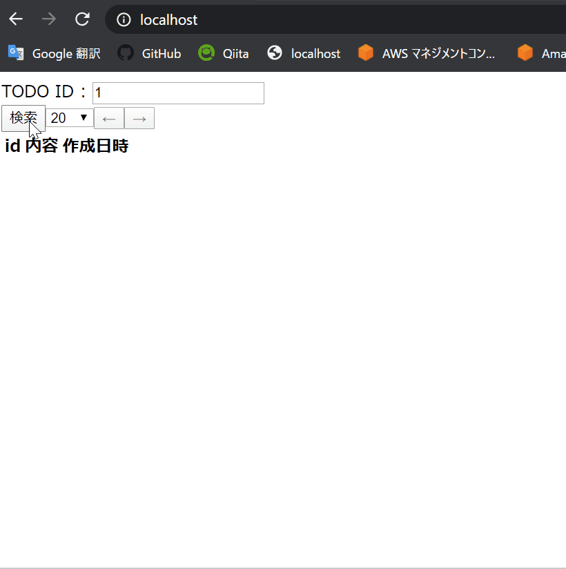

# elm_data_fetch_and_paging
Learning Elm fetch and paging web application.

## Elm fetch and paging sample.
Start database.
```sh
docker-compose up -d
```

Develop.
```sh
npm run dev
# Prod & release -> none...
```

## Image.

